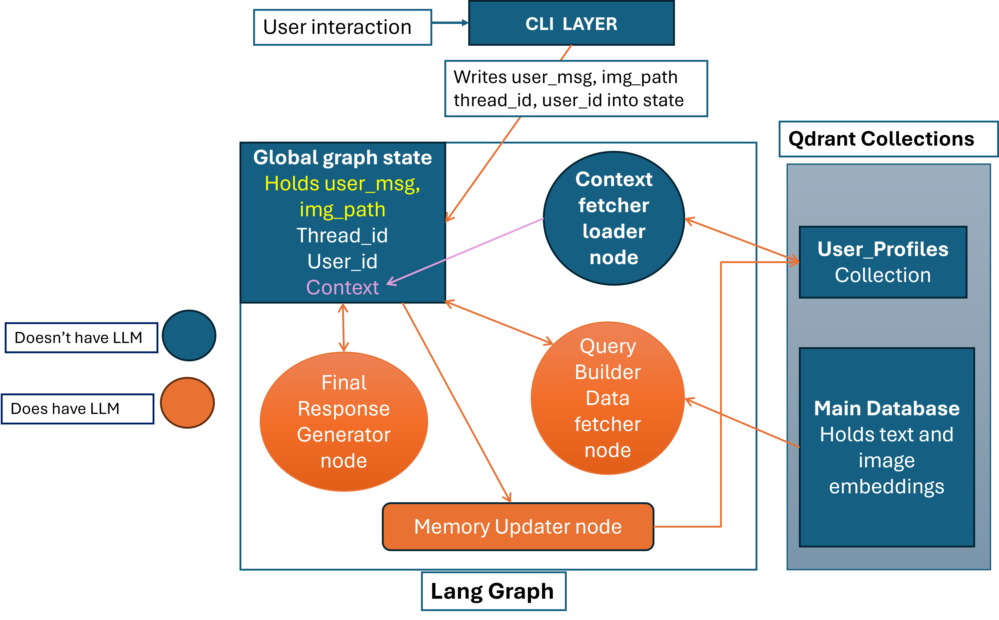
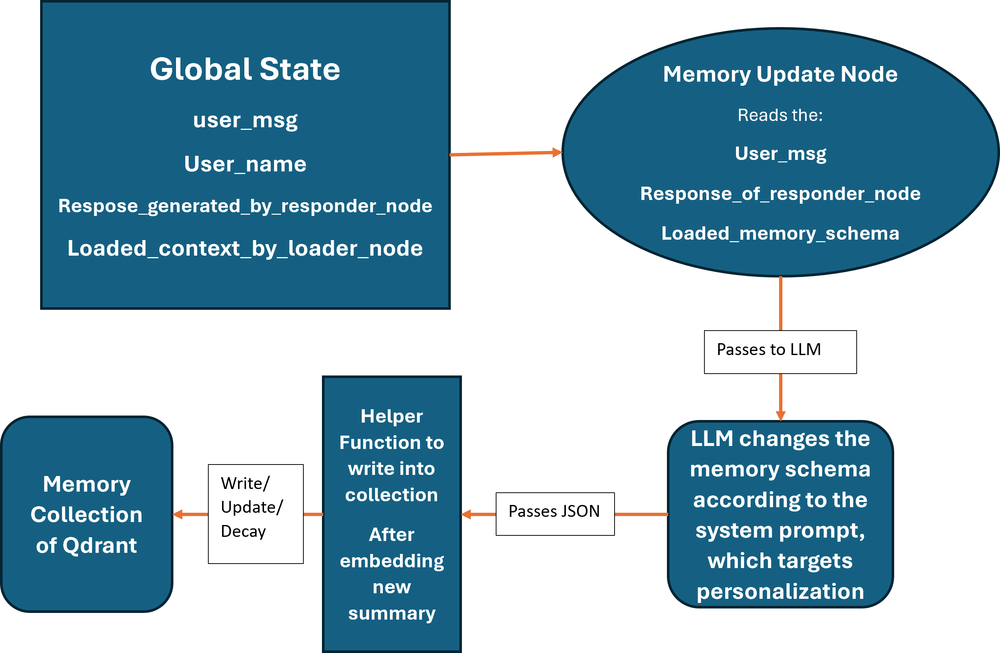

#  Misinformation Detection System for Indian Elections

[](https://www.python.org/)
[](https://qdrant.tech/)
[](https://langchain-ai.github.io/langgraph/)
[](https://typer.tiangolo.com/)

> A Graph-based AI Agent for detecting election misinformation, verifying EVM/VVPAT claims, and providing personalized assistance to election officials using Visual Forensics and Persistent Memory.

---

## 🚀 Overview

This system is not just a chatbot; it is a **Stateful Multi-Agent System** that maintains a psychological profile of the user (Long-Term Memory). It uses **Hybrid Search** (Dense + Sparse) to cross-reference claims against official Election Commission manuals and performs **Visual Search** to detect tampered devices from user-uploaded images.

## 🚀 Try my CLI

### Just sign with your github and run the cli app in your browser.

###[`VS code Live share link: click this`](https://prod.liveshare.vsengsaas.visualstudio.com/join?845C36447418ACB79ED817A75FFD34E49D60)


## 🚀 Demo Video

[](https://www.youtube.com/watch?v=ubVz3gEq6Vw)

## 📄 Documentation

For a detailed deep-dive into the embedding strategies and Qdrant configuration, open [`docs/index.html`](https://keshav-cuj.github.io/Info_on_Qdrant_MAS/) in your browser.


**Key Capabilities:**
* **Role-Based Memory:** Remembers if you are a "Presiding Officer" (needs technical rules) or a "Citizen" (needs reassurance) and adapts answers accordingly.
* **Visual Forensics:** Upload an image of an EVM control unit or VVPAT to verify its authenticity against a database of reference images.
* **Hybrid RAG:** Combines Semantic Search (Vector) and Keyword Search (BM25) for high-precision retrieval from legal manuals.
* **Self-Correction:** The agent generates a search plan, executes it, and can refine its search if initial results are poor.

---

## 🏗️ Architecture

The system is built on **LangGraph**, treating the conversation as a directed graph of functional nodes.


graph LR
    A[Start] --> B(Loader Node);
    B --> C{Query Generator};
    C -- Text Claim --> D[Hybrid Search];
    C -- Image Upload --> E[Visual Search];
    D --> F[Responder];
    E --> F;
    F --> G(Memory Writer);
    G --> H[End];


| Node | Function |
| --- | --- |
| **Loader** | Fetches the user's persistent profile (Persona, Style, Preferences) from Qdrant. |
| **Query Gen** | Analyzes the input and decides whether to use `search_hybrid` (text) or `search_image` (visual). |
| **Search Tools** | Executes the retrieval against the `election_manuals` Qdrant collection. |
| **Responder** | Synthesizes the answer using the retrieved evidence and the user's specific context. |
| **Memory Writer** | Uses an LLM to extract new facts/preferences and updates the `user_profiles` collection. |

---




## 🛠️ Tech Stack

* **Orchestration:** LangGraph, LangChain
* **Vector Database:** Qdrant (Self-hosted or Cloud) for memory and data.
* **Embeddings:**
* *Text:* `intfloat/multilingual-e5-base` (768d)
* *Image:* `clip-ViT-B-32` (512d)
* *Sparse:* FastEmbed (BM25)


* **LLM:** Google Gemini 2.5 Flash
* **CLI:** Typer & Rich (for the interactive terminal UI)

---

## ⚡ Installation

1. **Clone the repository**
```bash
git clone [https://github.com/yourusername/mas-election-agent.git](https://github.com/yourusername/mas-election-agent.git)
cd mas-election-agent

```


2. **Install Dependencies**
```bash
python3 -m venv .venv
.venv\Scripts\activate
pip install -r requirements.txt

```


3. **Environment Setup**
Change the `env.example` file to `.env` and fill in the values:


4. **Initialize Database**
Run the setup scripts to create collections and load initial manuals.
```bash
cd setup
python create_memory.py  # Creates 'user_profiles'
python populate_qdrant.py  # Creates 'data points'
```


---

## 🎮 Usage

Run the Interactive CLI Application:

### 1. Standard Mode (with UI)

log yourself in and hide raw logs behind a spinner.

```bash
cd ../ 
python cli.py

```

### 2. Demo/Debug Mode (Raw Logs)

Shows the internal thought process (Nodes, Plans, Search Results) in real-time. Great for judging/demos.

```bash
python cli.py --logs

```

### 3. CLI Commands

Inside the chat, you can use:

* `/new` - Start a fresh session (clears chat history, keeps memory).
* `/login <name>` - Switch user identity (loads a different memory profile).
* `/image <path>` - Attach an image to your query.
* *Example:* `/image assets/broken_seal.jpg Is this seal valid?`

### 👨‍💻 Some sample quries

*  https://github.com/Keshav-CUJ/Qdrant-convole/raw/main/images/EVMbackpack.png is this man stealing evm.
*  A digital news channel claimed that during Presidential Elections 2022, votes casted for Smt. Droupadi Murmu were declared invalid, give me proper evidence.

---

## 🧠 Memory Logic

We use a **Deterministic ID** approach for Long-Term Memory (LTM).

* We do not "search" for users.
* We generate a UUID based on the username: `uuid5(NAMESPACE, "officer_keshav")`.
* This ensures instant, O(1) retrieval of the user profile without similarity search overhead.
* **Decay/Update:** The `Memory Writer` node acts as a "Scribe", summarizing the latest interaction and merging it with the existing profile, naturally discarding irrelevant details over time.




---

## 📄 Documentation

For a detailed deep-dive into the embedding strategies and Qdrant configuration, open [`docs/index.html`](https://keshav-cuj.github.io/Info_on_Qdrant_MAS/) in your browser.

---

### 👨‍💻 Author

Built for the Convolve 4.0 2026 by Keshav Bhatt.
